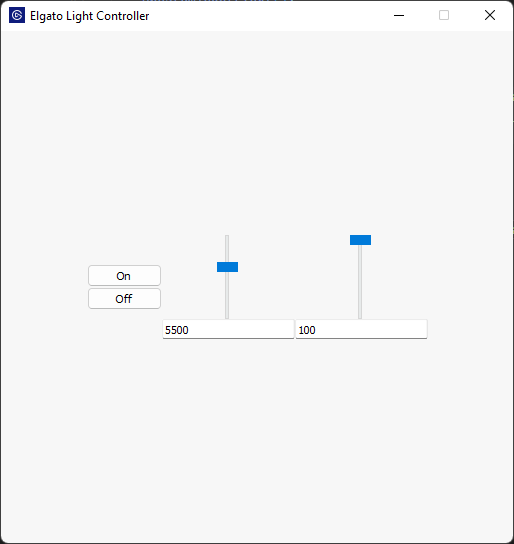

# elgato-light-gui
Control your Elgato lights from your Windows, MacOS, or Linux computer with a simple, cross-platform GUI built using NodeJS and NodeGUI.

It isn't pretty, but it works!

Thanks to [Nick Parks for `elgato-light-api`](https://github.com/NickParks/elgato-light-api), which I modified to work with my Elgato Key Light Air.

If you have any suggestions or notice any bugs, please feel free to open a PR or issue.

